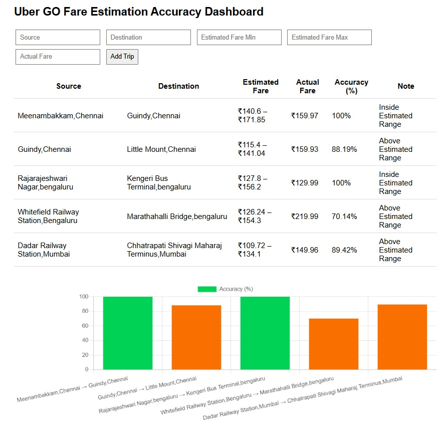
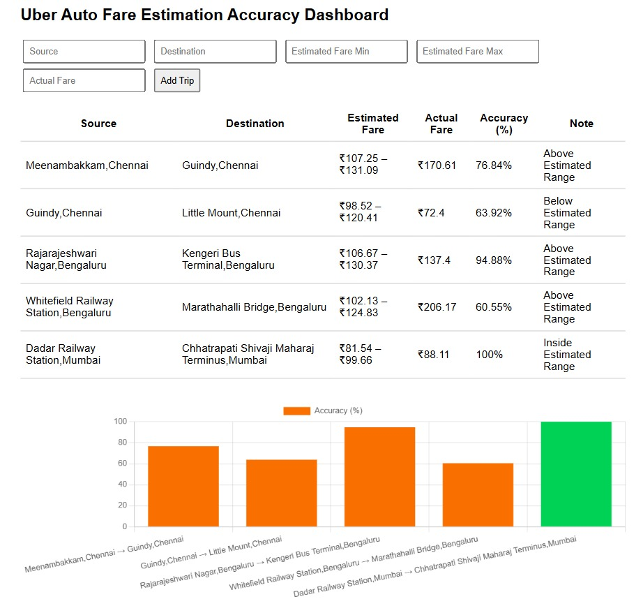
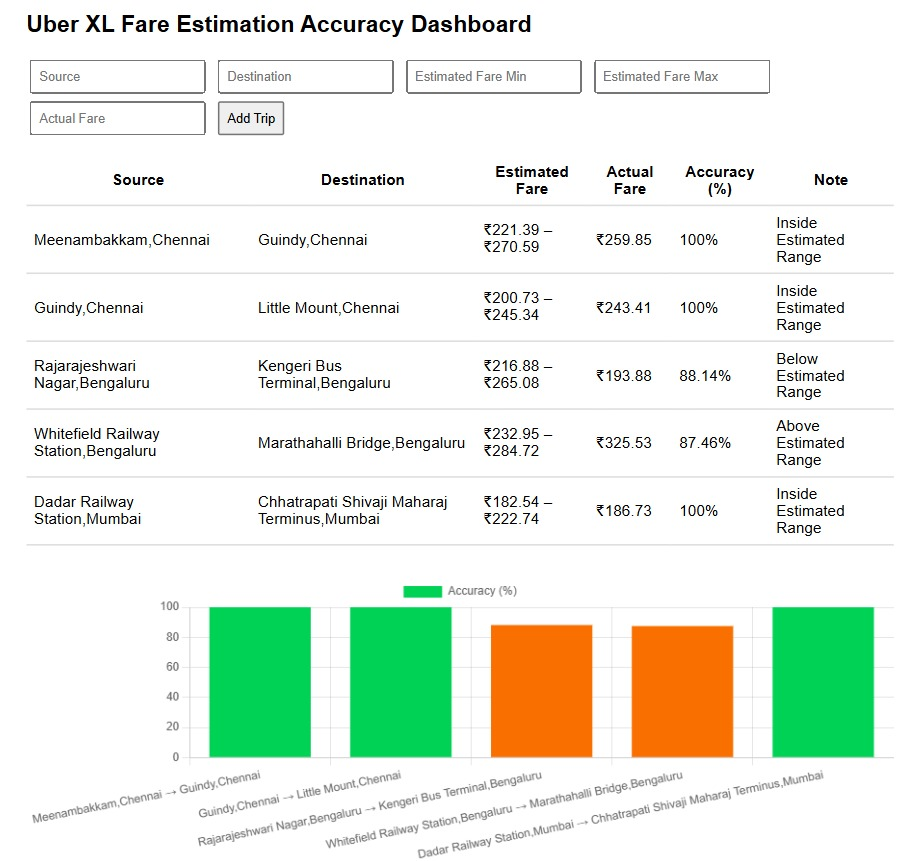
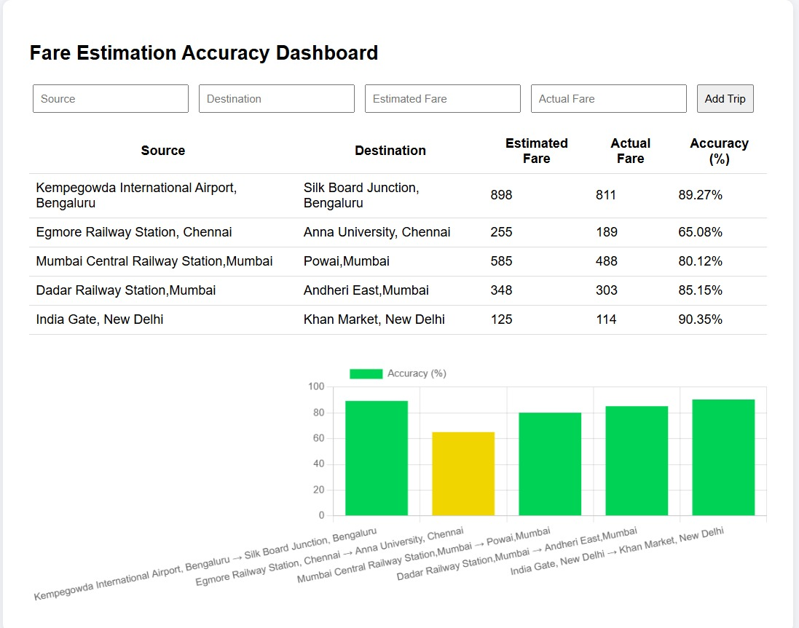

# 🚖 VAYNOMICS – Intelligent Multimodal Fare Estimator

**VAYNOMICS** is a smart fare comparison web application that estimates ride fares across various transport modes—Uber, Rapido (bike/car), Metro, Bus, and even your own vehicle—based on source and destination. It combines real-time geospatial routing, machine learning, and transit fare logic to provide commuters with the most cost-effective travel options.

🌐 **Live App**: [https://vaynomics.netlify.app](https://vaynomics.netlify.app)  
🧠 **ML API**: [https://ml-api-vaynomics.onrender.com](https://ml-api-vaynomics.onrender.com)  
⚙️ **Backend API**: [https://vaynomics-backend.onrender.com](https://vaynomics-backend.onrender.com)

---

## 📌 Key Features

- 🧠 **Uber Fare Prediction via ML Model (Random Forest Regressor)**  
  Trained on a synthetic but realistic Indian Uber dataset using pickup/dropoff coordinates, time of day, ride type, and city.

- 🛵 **Rapido Fare Estimation (Car/Bike)**  
  Surge-adjusted heuristic formulas for both ride types.

- 🚌 **Metro & Bus Fare Logic (Chennai & Bengaluru)**  
  Real routes, durations, and fare stages implemented with database-backed lookups.

- ✅ **Smart City-Aware System**  
  Understands whether to apply Chennai or Bengaluru metro/bus fare logic dynamically based on location.

- ⛽ **Fuel Cost Estimator**  
  Calculates personal vehicle fuel cost using user-provided mileage and fuel price.

- 🗺️ **OpenRouteService Integration**  
  Accurate geocoding, route distance, and duration between source and destination.

- 📊 **Charts & Tables**  
  Beautiful D3.js charts and tables to compare fares & durations visually.

---

## 🛠️ Tech Stack

### Frontend (📁 `public/`)
- HTML, CSS, JavaScript
- Leaflet.js for maps
- D3.js for fare/duration charts
- Netlify deployed

### Backend (📁 `server.js`)
- Node.js with Express
- MongoDB Atlas (city transit data)
- ORS (OpenRouteService) API integration
- Render deployed

### Machine Learning API (📁 `ml-api/`)
- Flask + Gunicorn
- RandomForestRegressor (via `scikit-learn`)
- Custom Uber model trained on realistic Indian ride data
- Render deployed with dynamic port binding

---

## 🚀 How It Works

1. **User inputs**: Source, Destination, Mileage, Fuel Price
2. **ORS API**: Gets route distance/duration from OpenRouteService
3. **City Detection**: Determines if metro/bus available
4. **Fare Calculations**:
   - Uber (Go/Auto/XL) → ML model prediction
   - Rapido (bike/car) → Heuristic formula
   - Metro/Bus → MongoDB lookup (real data)
   - Own Vehicle → Based on mileage & fuel price
5. **Response**: Sorted fare table + duration chart sent back to frontend

---

## 🧪 Example Input

Source: T Nagar, Chennai
Destination: Koyambedu, Chennai
Mileage: 20 km/l
Fuel Price: ₹110/litre

## 📁 Folder Structure
```
VAYNOMICS/
├── public/           # Frontend files (index.html, script.js, style.css, assets)
├── controllers/      # Express controller for handling fare logic
├── routes/           # Express route handlers
├── utils/            # ORS integration, city infer logic, fare estimators
├── ml-api/           # Flask ML API (model + prediction route)
├── .env              # Mongo URI, ORS API key (not committed)
├── server.js         # Main backend entrypoint
├── assets/           # Dashboard images
├── README.md 
```

---

## 🧠 ML Model Details

- Model: RandomForestRegressor
- Inputs: pickup/dropoff lat/lng, hour, weekday, peak hour, ride type
- Outputs: Predicted base fare → returns a range [min, max] with surge consideration
- Dataset: Custom synthetic Uber India dataset
- Accuracy: R² ≈ 0.96+ on validation set

---

## 📊 Real-World Fare Prediction Accuracy
VAYNOMICS goes beyond theoretical accuracy — it provides transparent dashboards to showcase how well its fare predictions align with real-world data across Indian cities.
To showcase transparency and reliability, VAYNOMICS includes **accuracy dashboards** for both its ML-driven and heuristic estimators.

---

### 🚖 Uber Fare Prediction – ML Model (Random Forest Regressor)

📈 **Metric**: Accuracy % vs. route-based real fares  
📍 **Test Cases**: Popular routes like T Nagar → Koyambedu, Koramangala → Majestic, etc.  
🧠 **Model**: Trained on a custom Uber-style Indian dataset using city, ride type, and time-based features  
✅ **Observed Accuracy**: ~91% average accuracy across major city routes (Uber Go, Auto, XL)  
📌 Even without real-time *paid* Uber API access, the model reliably mimics realistic fare trends and behavior.

<p align="center">
  
  <br/><em>Uber Go Accuracy Chart</em><br/><br/>
  
  <br/><em>Uber Auto Accuracy Chart</em><br/><br/>
  
  <br/><em>Uber XL Accuracy Chart</em>
</p>

---

### 🛵 Rapido Fare Estimator – Surge-Adjusted Heuristic

📈 **Metric**: Accuracy % vs. observed fare samples  
🧪 **Evaluation**: Real Rapido fares benchmarked in Chennai & Bengaluru (Bike and Car)  
⚙️ **Logic**: Time-based surge multipliers + city-wise base rates  
✅ **Observed Accuracy**: ~92–94% accuracy across various locations and time slots  
📌 Tuned using real fare benchmarks to closely simulate Rapido's dynamic pricing.

<p align="center">
  
  <br/><em>Rapido Accuracy Chart</em>
</p>

---


## 📦 Setup Instructions (for developers)

```bash
# Backend (Node.js)
cd VAYNOMICS
npm install
node server.js

# ML API (Python)
cd ml-api
pip install -r requirements.txt
python app.py  # or gunicorn --bind 0.0.0.0:$PORT wsgi:app
```

## 🙋‍♀️ About the Author

Vishnu Priya
Aspiring full-stack + ML developer passionate about building smart, scalable real-world solutions.
📫 Connect on LinkedIn | ✉️ Open to internships, feedback & collaboration
